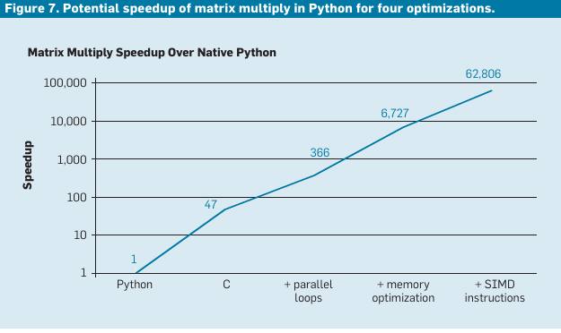
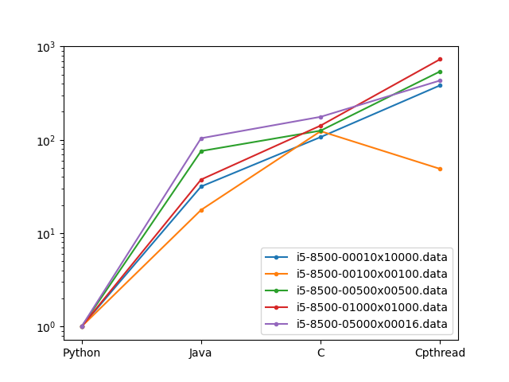

# Matrix-Multiply-Is-Patterson-Right

## Idea ##

This small project is an educationnal project. The idea is to show the
performance improvement for a simple algorithm between an
implementation in :

* [x] an interpreted version (naive python),
* [x] a Java naive version
* [x] a C naive version
* [x] a C parallel version (pthreads)
* [ ] a C parallel and optimized for memory access (pthreads + tiles)
* [ ] a C parallel and optimized for memory access with vectorized operators (vector)

This is NOT
* an optimized version for all platforms,
* an optimized version for all intel platforms

This is just a tutorial to show the impact in term of performances of
different optimization approaches and to verify that Pattersion is
right about performance improvment (see slide "There is plenty room at
the top" in the video) or the article "A New Golden Age for Computer Architecture"

## Experiment

We run multiple variant of the matrix multiplication. The main differences with the __original code__ are
* We use dynamic allocation for matrices
* We use multiple size matrices
* We use non square matrices

Comments on our experiments : TBD

## Authors ##

* Henri-Pierre Charles
* Riyane Sid Lakdhar
* Kevin Mambu

## References ##

* Is Patterson right about matrix multiplication ? https://www.youtube.com/watch?v=3LVeEjsn8Ts&t=365s
* https://martin-thoma.com/matrix-multiplication-python-java-cpp/
* "There’s plenty of room at the Top: What will drive
computer performance after Moore’s law?" https://www.science.org/doi/pdf/10.1126/science.aam9744
* Original code from the previous article : https://github.com/neboat/Moore/tree/master